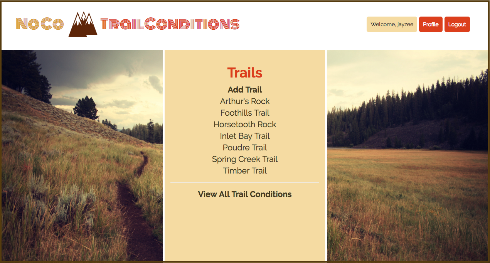
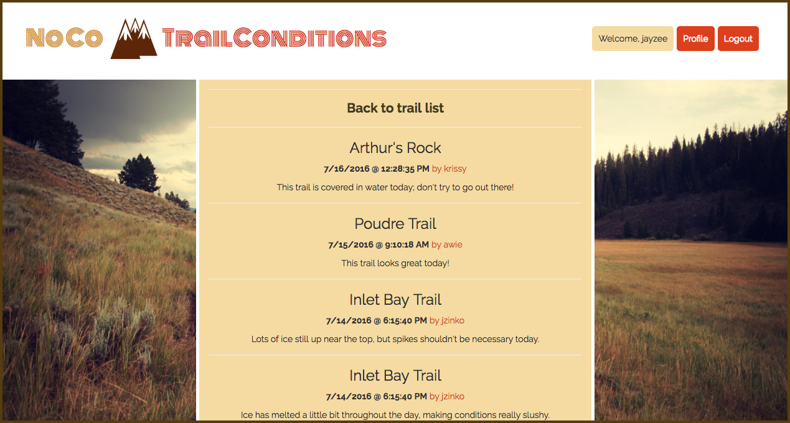
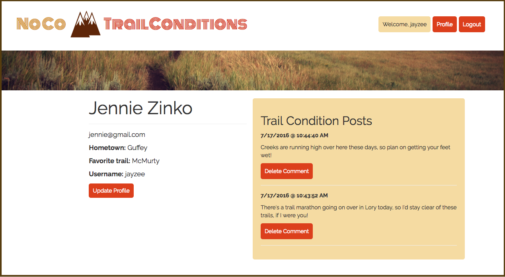

# NoCo Trail Conditions

Anybody who has tried to run or hike in Colorado through cold, snowy winters, spring deluges, sweltering summer heat, or frequent fall racing events knows that any two consecutive days on your favorite trail might necessitate drastically different gear and preparation. [NoCo Trail Conditions] (https://noco-trail-conditions.herokuapp.com/) is an Express application that was built in order to bring updates on current Northern Colorado trail conditions to runners and hikers interested in visiting these trails.

Upon entering the site, users are presented with the option to register, login, or see a list of trails.

Clicking on any of these directs a user to the trail-specific page that lists details about the trail, as well as the three most recent trail conditions posted.

If logged in, a user sees the option to add a new condition update to the trail's page.

Alternately, if a user is using the site to decide which trail to visit that day, he or she may elect to see a list of recently posted trail conditions.

Users have access to their own profile information, and there can see a list of their trail condition updates, as well as update information they provided on registering.

Technologies used to build the app include Knex.js for building PostgreSQL queries, Bootstrap for styling, and EJS for templating. Node.js and Express.js were used to build the application's backend.
